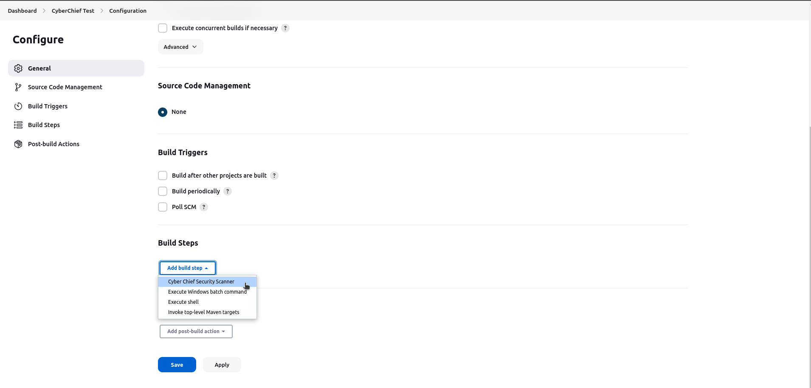
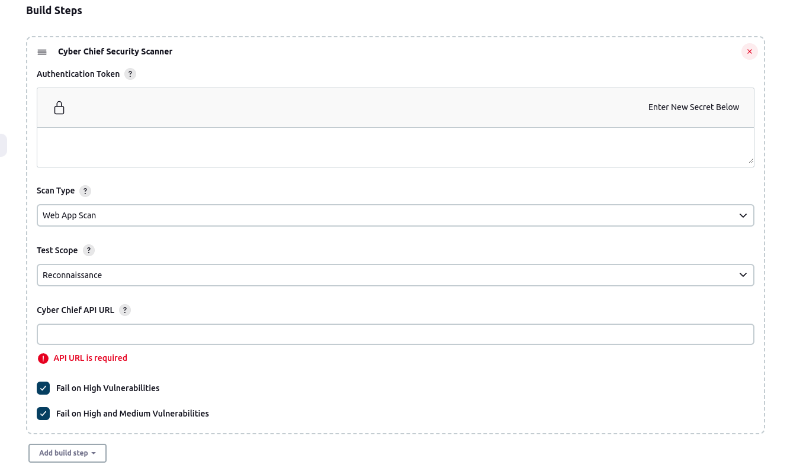
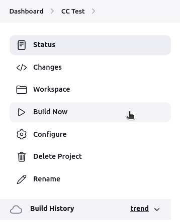

# Cyber Chief Security Scanner

## Introduction

Run Cyber Chief Scans from Jenkins using Cyber Chief Security Scanner Plugin.

### Download and Install Cyber Chief Scanner plugin in Jenkins
1. In your Jenkins Dashboard, navigate to `Manage Jenkins > Manage Plugins`
2. Select Available Plugins and search for `Cyber Chief Security Scanner`
3. Install and restart your Jenkins console. You can confirm that the extension is enabled if you go to `Manage Jenkins > Manage Plugins > Installed Plugins > Look for Cyber Chief Security Scanner` and see if its enabled.

### Running Scans on Jenkins
1. Create a Freestyle project and name it anything.

2. Navigate to `Configure` tab and select `Add Build Step`.
3. Select Cyber Chief Security Scanner.

4. Configure the form fields as required.
    - `Auth Token` is located on the left side of your Cyber Chief Workspace Admin Page
    - `API URL` is located below the `Auth Token`
    - Select what type of Scan you want to run `(Web App, API, Raider)`
        - For Web App Scans: Select the scope of the scan
        - For API Scans: Input API Name
        - For Raider Scans: Input Raider Name, Select Regions, Services, and Frameworks
    - You have the option to fail the build when:
        - High Vulnerabilities are found
        - Both High and Medium Vulnerabilities are found
    - NOTE: If you have chosen not to check them both, Jenkins will run a scan on Cyber Chief without waiting for the results after clicking `Build Now`.

5. Save and click Build Now

 

## LICENSE

Licensed under MIT, see [LICENSE](LICENSE.md)

